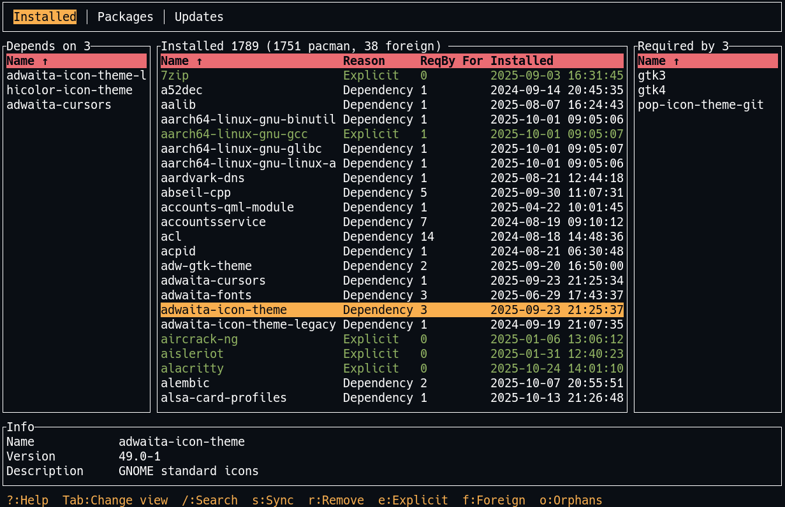

# mspacman
A simple tool to view dependencies of pacman installed packages.

## Features
- view dependencies of pacman installed packages
- jump around dependencies and follow dependency chain
- view explicitly installed packages
- sort by number of dependencies
- find package
- filter by name, explicitly installed, orphans

