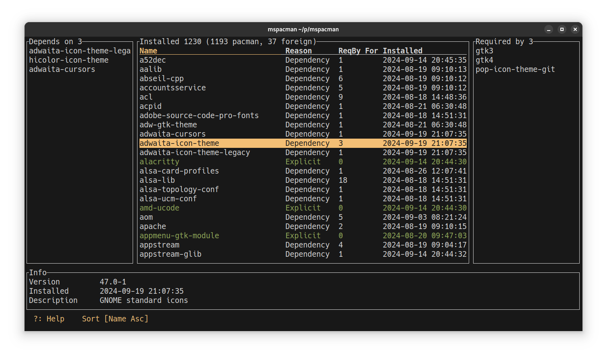

# mspacman
A simple tool to view dependencies of pacman installed packages in Arch linux and derivatives

## Requires
- pacman to be installed

## Install
cargo install mspacman

## Features
- view dependencies of pacman installed packages
- view parent and child dependencies
- jump around dependencies and follow dependency chain
- view explicitly installed packages
- sort by number of dependencies
- find package
- filter by name, explicitly installed, orphans, foreign installed
- view the files that is provided by a package
- run commands on selected packages: remove, update, query

